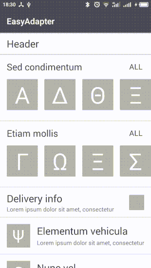

# EasyAdapter
This project demonstrates simple approach for implementation complex lists, based on RecyclerView.

You don't need call methods notify...(), beсause it is called automatically when you set data. It also works with mutable data objects, unlike `android.support.v7.util.DiffUtil`. You also don't need extend RecyclerView.Adapter. 

You need only create ItemController for each type of list items and describe order of elemets in Activity/Fragment.
ItemController incapsulates all interactions with list item, so it is very easy for reading, modifying and reusing.

Project contains  of ItemController for Android Studio. 

A big thanks to  developers, especially to  , for their help in developing.

## Example 1 - Six types of elements:


Code in activity:
```kotlin
 private fun initList() {
    this.adapter = EasyAdapter()
    recycler.itemAnimator = SlideItemAnimator()
    recycler.layoutManager = LinearLayoutManager(this)
    recycler.adapter = adapter

    headerController = HeaderController()
    carouselController = CarouselController(
            onElementClickListener = { openPaginationScreen() },
            onShowAllClickListener = { openPaginationScreen() })
    deliveryController = DeliveryController(
            onClickListener =  { openPaginationScreen() })
    commercialController = CommercialController(
            onClickListener =  { openPaginationScreen() })
    elementController = ElementController(
            onClickListener = { openPaginationScreen() })
    emptyStateController = EmptyStateController()
}

fun render(screenModel: MainScreenModel) {
    val itemList = ItemList.create()
            .addIf(screenModel.hasHeader(), headerController)
            .addAll(screenModel.carousels, carouselController)
            .addIf(!screenModel.isEmpty(), deliveryController)
            .addIf(screenModel.hasCommercial, commercialController)
            .addAll(screenModel.elements, elementController)
            .addIf(screenModel.hasBottomCarousel(), screenModel.bottomCarousel, carouselController)
            .addIf(screenModel.isEmpty(), emptyStateController)
    adapter.setItems(itemList)
    //You don't need call notify...() methods and override getItemViewType(), onBindViewHolder(), etc. inside Adapter  
}
```

Example of ItemController:
```kotlin
class ElementController(
        val onClickListener: (element: Element) -> Unit
) : BindableItemController<Element, ElementController.Holder>() {

    override fun createViewHolder(parent: ViewGroup): Holder = Holder(parent)

    override fun getItemId(data: Element): Long = data.id.hashCode().toLong() //must return unique value for element

    inner class Holder(parent: ViewGroup) : BindableViewHolder<Element>(parent, R.layout.element_item_layout) {
        private lateinit var data: Element
        private val nameTv: TextView

        init {
            itemView.setOnClickListener { onClickListener.invoke(data) }
            nameTv = itemView.findViewById(R.id.name_tv)
            //find views here
        }

        override fun bind(data: Element) {
            this.data = data
            nameTv.text = data.name
            //render data here
        }
    }
}
```

## Example 2 - Loading data and pagination:


Placeholders is also elements of RecyclerView

Code in activity:
```kotlin
fun render(screenModel: PaginationScreenModel) {
    val itemList = when (screenModel.loadState) {
        LoadState.LOADING -> ItemList.create(screenModel.stubs, stubController)
        LoadState.ERROR -> ItemList.create(errorStateController)
        LoadState.EMPTY -> ItemList.create(emptyStateController)
        LoadState.NONE -> ItemList.create(screenModel.elements, elementController)
    }
    adapter.setItems(itemList, screenModel.paginationState)
}
```
Code in presenter for pagination:
```kotlin
fun loadMore() {
    loadMoreSubscription = subscribe(
            elementRepository.getElements(screenModel.elements.nextPage),
            { elements ->
                screenModel.elements.merge(elements) //merge old data with new block
                screenModel.setNormalPaginationState()
                view.render(screenModel)
            },
            { _ ->
                screenModel.setErrorPaginationState()
                view.render(screenModel)
            })
}
```

## License
```
Copyright 2016 Maxim Tuev

   Licensed under the Apache License, Version 2.0 (the "License");
   you may not use this file except in compliance with the License.
   You may obtain a copy of the License at

       http://www.apache.org/licenses/LICENSE-2.0

   Unless required by applicable law or agreed to in writing, software
   distributed under the License is distributed on an "AS IS" BASIS,
   WITHOUT WARRANTIES OR CONDITIONS OF ANY KIND, either express or implied.
   See the License for the specific language governing permissions and
   limitations under the License.
```

